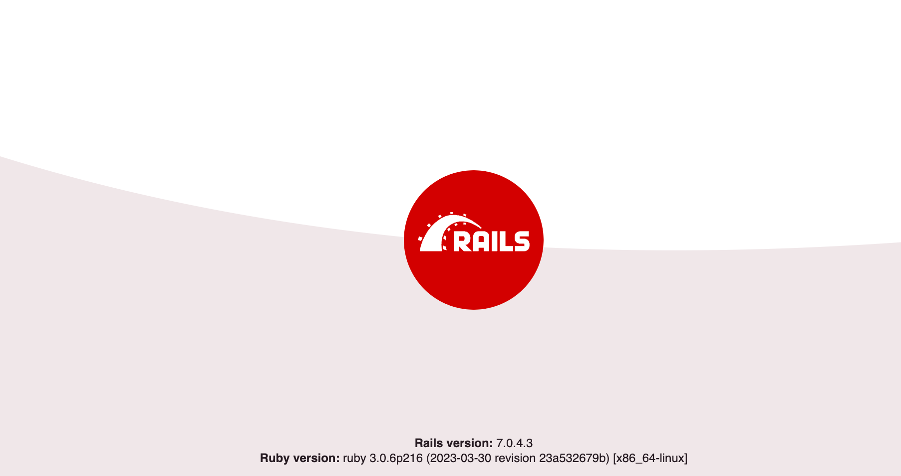

# Technical DevOps 
this the document for full CI/CD Using GitOps Methodology You can see this Image the output of Applications 

# DevOps Task 
This tutorial walks you through all answers related to task 

# Dockerize THE APP 
Create a Dockerfile to build a docker image and automate the setup of your API
service with Docker, so it can be run everywhere comfortably with one or two
commands. 
Bonus points:
be sure to use best practices for creating Docker files: i.e. proper layer
structure, multi-stage builds if needed, security practices for building/running
containers.

* [dockerize](docs/docker.md)

# Create CI Using Jenkins 
To create Continuous Integration (CI) using Jenkins, you can utilize the Jenkins Job DSL plugin along with the Jenkins Build DSL. The Jenkins Job DSL plugin allows you to define and manage Jenkins jobs programmatically, while the Jenkins Build DSL provides a way to describe the build steps within a job using a Groovy-based DSL. Here's an example of how you can create a CI pipeline using these tools will exaplain 

* [Jenkins](docs/jenkins.md)

# Create helm chart 
A Helm chart is a package format for defining and deploying applications on Kubernetes. It provides a convenient way to package, version, and manage the deployment of complex applications with multiple Kubernetes resources.
create a Helm chart for a Ruby app that has been Dockerized, you can follow these 

* [Helm](docs/helm.md)

# Create CD  Using ArgoCD 
is a declarative continuous delivery (CD) tool for Kubernetes. It helps automate the deployment and lifecycle management of applications in Kubernetes clusters. Argo CD uses a GitOps approach, where the desired state of the applications is defined in a Git repository and automatically synchronized with the target cluster.
Key features and benefits of Argo CD include:
To create Continuous Deployment (CD) using Argo CD, you can follow these 

* [ArgoCD](docs/ArgoCD.md)

# CI/CD With Jenkins and ArgoCD
Jenkins and Argo CD can be combined to create a powerful CI/CD pipeline for deploying applications to Kubernetes. Here's a high-level overview of how you can integrate Jenkins and Argo CD in your CI/CD workflow

* [CI/CD](docs/CICD.md)

